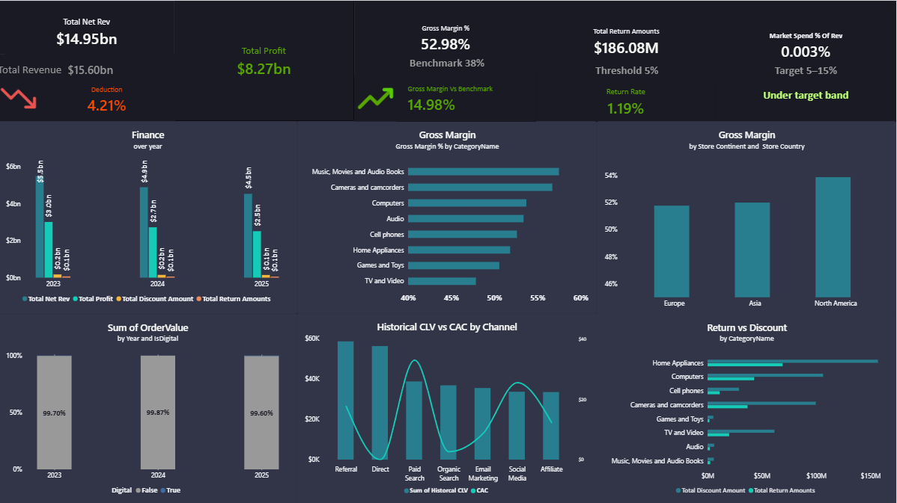

# Project Title: Retail Contoso Analysis

# Project Overview:
Analysis of a large scale retail dataset (30M rows, 11 fact tables, 12 dimension tables ) 
built to deliver insights across executive stakeholders using Power BI and SQL Server.
Period: 2023 to 2025

# Audience & Dashboards:
## Dashboard 1 CFO: (it answers)
    1- What is our revenue after discounts and returns, and what is our total profit?
    2- What is marketing spend as % of revenue?
    3- What is our gross margin by product category and geography? 
    4- What is payment method mix and digital adoption trend?  
    5- What is the CAC vs CLV payback channel? 
    6- What is the return vs discount relationship by category?

## Key Findings
    1- Total Net Revenue: $14.95bn | Total Profit: $8.27bn
    2- Gross Margin: 52.98%, 14.98% above the 38% industry benchmark
    3- Music & Movies is the highest gross margin category at 57.48%
    4- Home Appliances has the highest discounts and highest return rate
    5- Return Rate: 1.19%, well within the 5% threshold

# Tools
    1- Microsoft Power BI (Composite mode(DirectQuery, Import, Dual), DAX, Interactive Dashboards, Time intelligence)
    2- SQL Server(Built views for data preparation)

# Recommendations:
    1- Investigate digital payment adoption currently less than 0.05% of transactions, which is significantly below modern retail standards
    2- Reallocate marketing budget toward Organic Search which outperforms Social Media and Email Marketing in CLV generation
    3- Review pricing or product strategy in Germany (50.08%) and China (51.09%) where gross margins are the lowest across all markets
    4- Increase marketing spend from current 0.003% of revenue toward the target band of 5 to improve customer acquisition
    

# Limitations & Future Improvements:
    1- Some tables are synthesis to make the project more impactful
    2- Marketing spend data appears inconsistent with revenue nor benchmark
    3- Digital payment data (99.7% non digital) is likely unrealistic for a modern retailer
