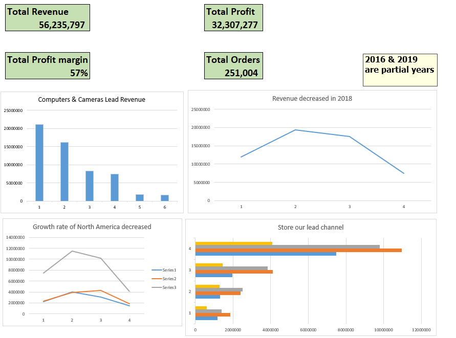
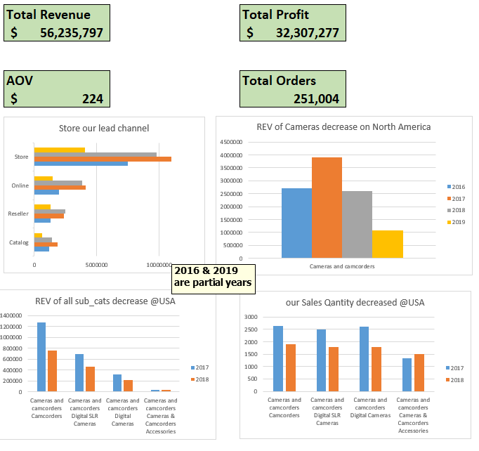
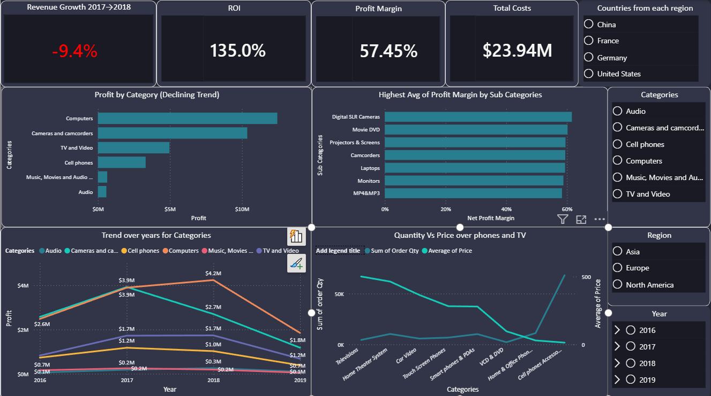

# Project Title: Sales Performance Analysis Contoso Dataset

# Dataset Overview:
dataset from +15K rows contain different columns the data time between 6-2016 to 6-2019

# Audience & Dashboards:
## Dashboard 1 CEO: 
    1- Our Profit margin is 57% through last 3 yeasrs (6-2016 to 6-2019)
    2- Revenue decreased from 2017 to 2018  
    3- North America revenue declining since 2017 peak while Asia shows consistent growth

## Dashboard 2 Sales Manager: 
    1- Our sales decreased in 2018
    2- Cameras category have big decreased in 2018  
    3- stores still our lead channel
    4- Cell phones buy highr in Asia through time as it achieved Growth rate around 20%

## Dashboard 3 Product Manager: 
    1- our ROI is 135% through last 3 yeasrs (6-2016 to 6-2019)
    2- Our Revenue Growth 2017 to 2018 is -9.4%
    3- Computers lead profit across all regions.

# Recommendations:
    1- merge complementary products such as Computers with Accessories to increase AOV 
    2- Asia our promising marketing specially China
    3- We lose our market in North Amerca so we have to do some marketing and sales to high our Revenue

# Limitations & Future Improvements:
    1- Dataset contains 15K rows which limits statistical significance
    2- limited dates to track patterns
    3- no date about castomers so I can't apply analyze on what product sold why
    4- no data about which Items ordered together to try increse AOV based on data
